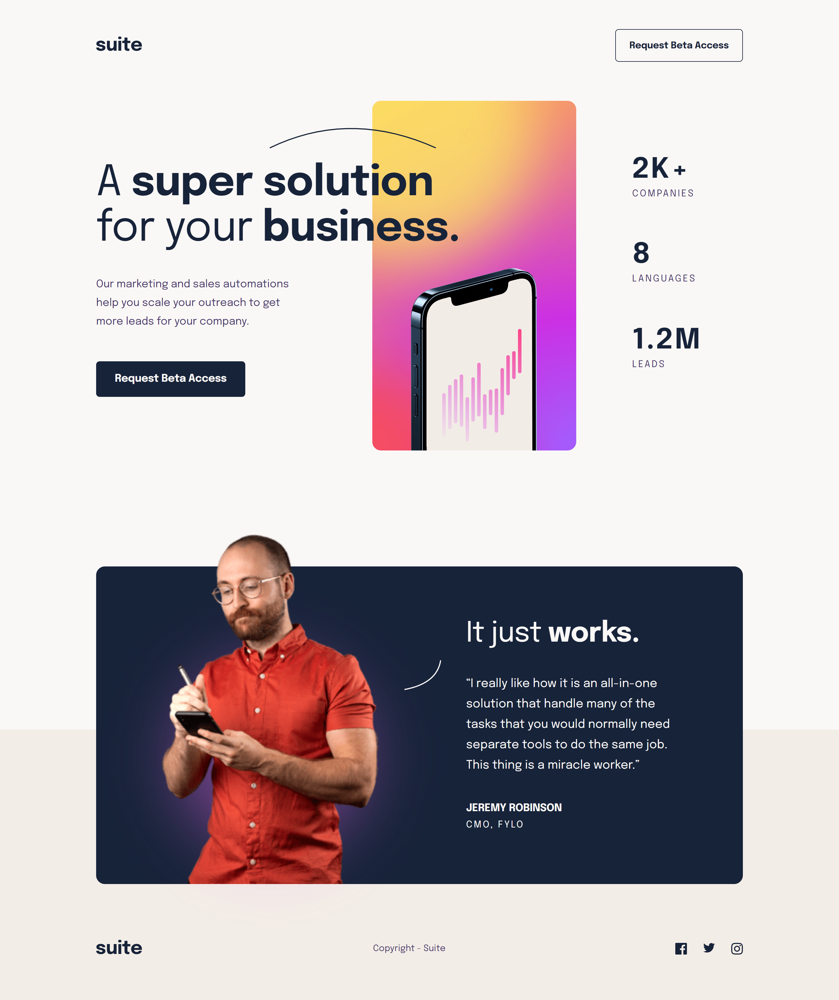

# Frontend Mentor - Suite landing page solution

This is a solution to the [Suite landing page challenge on Frontend Mentor](https://www.frontendmentor.io/challenges/suite-landing-page-tj_eaU-Ra). Frontend Mentor challenges help you improve your coding skills by building realistic projects.

## Table of contents

- [Overview](#overview)
  - [The challenge](#the-challenge)
  - [Screenshot](#screenshot)
  - [Links](#links)
- [My process](#my-process)
  - [Built with](#built-with)
  - [What I learned](#what-i-learned)
  - [Continued development](#continued-development)
  - [Useful resources](#useful-resources)
- [Author](#author)

## Overview

### The challenge

Users should be able to:

- View the optimal layout depending on their device's screen size
- See hover states for interactive elements

### Screenshot



### Links

- Solution URL: [Add solution URL here](https://your-solution-url.com)
- Live Site URL: [miguelzaga.github.io/suite-landing-page](https://miguelzaga.github.io/suite-landing-page/)

## My process

### Built with

- Semantic HTML5 markup
- Sass
- Flexbox
- Mobile-first workflow

### What I learned

This is my first time using Sass nesting. It is incredible, it makes the code look neat and easier to read. A combination of BEM structure and nesting is unbelievable.

I found interesting the way that I placed the showcase pattern over the 'super solution' text. The HTML looks a bit of a mess but I like it and seems to work.

```html
<h1 class="showcase__title">
  A
  <b class="showcase__pattern-container">
    super solution
    
  </b>
  for your <b>business.</b>
</h1>
```

```css
.showcase {
  &__pattern-container {
    display: inline-block;
    position: relative;
  }

  &__pattern {
    position: absolute;
    top: - calc(19px + 8.32px);
    right: 0;
    height: 19px;
    width: 151.47px;
  }
```

### Continued development

I want to improve my understanding of SVG and the ways to use them in a website.

### Useful resources

- [CSS Gradient](https://cssgradient.io/) - This is an amazing resource to get gradients. I helped me do the primary button hover.

## Author

- Website - [Miguel Zapata](https://www.miguezaga.online)
- Frontend Mentor - [@miguelzaga](https://www.frontendmentor.io/profile/miguelzaga)
